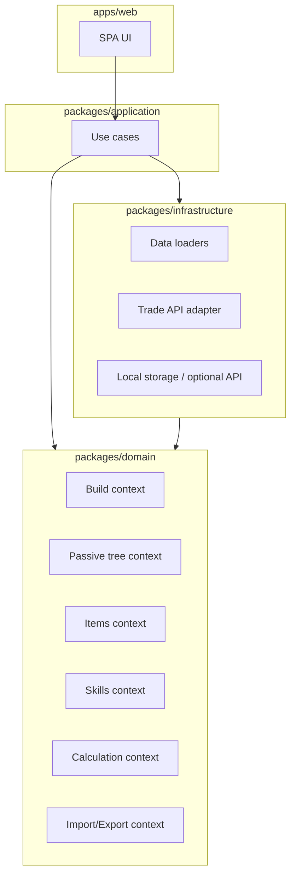

# Plano: clone funcional em TypeScript (web) a partir do Path of Building

## Contexto do projeto atual

O repositório é **Path of Building Community**: aplicação **Lua** com runtime **SimpleGraphic** (`[src/Launch.lua](c:\Users\Josiel\PathOfBuilding\src\Launch.lua)`), modo principal em `[src/Modules/Main.lua](c:\Users\Josiel\PathOfBuilding\src\Modules\Main.lua)` e núcleo de build em `[src/Modules/Build.lua](c:\Users\Josiel\PathOfBuilding\src\Modules\Build.lua)`. O motor de cálculo está fragmentado em módulos `Calc`\* (`[src/Modules/Calcs.lua](c:\Users\Josiel\PathOfBuilding\src\Modules\Calcs.lua)`, `CalcSetup`, `CalcPerform`, `CalcOffence`, `CalcDefence`, `CalcActiveSkill`, etc.). Dados massivos em `[src/Data/](c:\Users\Josiel\PathOfBuilding\src\Data)` e árvores em `[src/TreeData/](c:\Users\Josiel\PathOfBuilding\src\TreeData)`. Testes existentes em `[spec/System/](c:\Users\Josiel\PathOfBuilding\spec\System)` e builds de referência em `[spec/TestBuilds/](c:\Users\Josiel\PathOfBuilding\spec\TestBuilds)` (comparação de `mainOutput` — ver `[spec/System/TestBuilds_spec.lua](c:\Users\Josiel\PathOfBuilding\spec\System\TestBuilds_spec.lua)`). Documentação de layout em `[docs/rundown.md](c:\Users\Josiel\PathOfBuilding\docs\rundown.md)`. Execução headless possível via `[src/HeadlessWrapper.lua](c:\Users\Josiel\PathOfBuilding\src\HeadlessWrapper.lua)`.

**Realismo:** paridade **literal** com PoB é um esforço de **muito longo prazo** (dezenas de milhares de linhas de domínio + dados). O plano assume **entrega por fases** com critérios de aceite mensuráveis (números de saída, XML, comportamento de UI), não um “big bang”.

---

## Visão de arquitetura (DDD + web)

- **Domínio (puro):** agregados `Build`, `PassiveSpec`, `Item`, `SocketGroup`, serviços de domínio para regras que não pertencem a uma única entidade; **sem** dependência de React, `fetch` ou `localStorage`.
- **Aplicação:** casos de uso (ex.: “calcular build”, “importar XML”, “alocar nó”, “gerar query de trade”) orquestram domínio + portas.
- **Infraestrutura:** implementações de portas (carregar JSON de dados, cliente HTTP para trade com **proxy backend** se necessário por CORS), serialização XML.
- **App web:** **[React 19](https://react.dev/)**; camada fina (rotas, composição); **componentes** com **[shadcn/ui](https://ui.shadcn.com/)** + **Tailwind CSS** (tipado em TypeScript); **dados assíncronos e cache HTTP** com **[TanStack Query](https://tanstack.com/query/latest)** (ver **ADR-006**) — a lógica de negócio permanece em `domain` / casos de uso; Query **não** substitui o motor de cálculo, apenas orquestra `fetch`, cache e estados de pedido na UI.

**Fronteiras explícitas:** usar regras de import (ex.: `eslint-plugin-boundaries` ou `dependency-cruiser`) para impedir que `domain` importe `application` ou `apps/web`.

---

## Estratégia de dados (crítica para paralelismo)

- **Fonte da verdade dos dados de jogo:** continuar gerando/atualizando artefatos a partir do pipeline PoB (GGPK → Export) onde aplicável; no TS, consumir **JSON estável** versionado (por liga/versão de árvore), não portar `.lua` gigantes para TS à mão.
- **Contrato:** definir schemas (Zod ou JSON Schema) para `tree`, `gems`, `mods`, etc., com testes de snapshot dos artefatos.
- **Compatibilidade com testes de regressão:** pipeline CI que executa PoB headless (Lua) em builds de referência e grava `golden/*.json` de `mainOutput`; o pacote TS compara com tolerância numérica (como em `TestBuilds_spec`). Isso permite **agentes trabalharem no core** enquanto **QA** valida divergências.

---

## TDD (obrigatório no fluxo)

- **Red → Green → Refactor** por funcionalidade; PR sem teste que cubra o comportamento novo não entra (exceto prototipagem explícita em branch `spike/` sem merge).
- **Pirâmide:**
  - **Unitários (Vitest):** domínio e funções puras de cálculo; mocks mínimos.
  - **Integração (Vitest):** parsers XML, loaders de dados, composição `CalcSetup` + `buildOutput` com DB de mods em memória — mesmo runner; opcionalmente sufixos/pastas `*.integration.test.ts` ou projetos Nx dedicados para separar tempo de execução no CI.
  - **E2E (web):** **[Playwright](https://playwright.dev/)** (detalhes e alternativas rejeitadas em **ADR-003**); fluxos críticos: carregar build, abrir árvore, alterar item, verificar painel de stats (valores esperados de fixtures).

Ordem pretendida: **escrever teste que falha** (ou contrato) **antes** da implementação; para refactors grandes, teste de caracterização primeiro.

---

## Stack sugerida (web)

| Camada                   | Escolha                                                                                                                                                                                                                                                                            |
| ------------------------ | ---------------------------------------------------------------------------------------------------------------------------------------------------------------------------------------------------------------------------------------------------------------------------------- |
| Monorepo                 | **[Nx](https://nx.dev/)** — workspaces, graph de dependências, caching de tarefas, executores por projeto                                                                                                                                                                          |
| Gestor de pacotes        | **pnpm** (recomendado com Nx) ou npm/yarn, conforme preferência do time                                                                                                                                                                                                            |
| Bundle (app web)         | **[Rspack](https://rspack.dev/)** via plugin Nx (`@nx/rspack` ou configuração alinhada à documentação atual do Nx para React) — build rápido, compatível com ecossistema webpack quando necessário                                                                                 |
| UI                       | **[React 19](https://react.dev/)** + **[shadcn/ui](https://ui.shadcn.com/)** + **Tailwind CSS** — app fina; domínio fora de componentes                                                                                                                                            |
| Estado / dados async     | **[TanStack Query](https://tanstack.com/query/latest)** — cache, `fetch`, revalidação; **ADR-006** (alternativas: SWR, Redux Toolkit Query — documentar se relevante)                                                                                                              |
| TS                       | `strict`, `verbatimModuleSyntax`, path aliases geridos pelo Nx (`tsconfig.base.json` + project references)                                                                                                                                                                         |
| Testes unit + integração | **Vitest** — executor por projeto no Nx (`@nx/vite` com Vitest ou executor Vitest dedicado, conforme setup escolhido); **um único runner** para pirâmide inferior                                                                                                                  |
| E2E                      | **[Playwright](https://playwright.dev/)** — `@nx/playwright` ou executores Nx; projeto `e2e` no workspace; testes em TypeScript; traces e CI em headless                                                                                                                           |
| Lint / formatação        | **ESLint 9+** (flat config `eslint.config.js`), **TypeScript ESLint**, regras React e **Tailwind** (`eslint-plugin-tailwindcss` opcional), **eslint-config-prettier** (desliga regras que chocam com Prettier), integração **Nx** (`@nx/eslint-plugin` / alvos `lint` por projeto) |
| Formatação               | **Prettier** — única fonte de estilo; `prettier --check` no CI; ficheiros `.prettierignore` alinhados com builds                                                                                                                                                                   |
| Fronteiras de módulo     | **dependency-cruiser** e/ou `moduleBoundaryRules` do Nx + ESLint                                                                                                                                                                                                                   |
| Git hooks                | **Husky** + **lint-staged** — ver [secção dedicada](#qualidade-de-código-eslint-prettier-husky)                                                                                                                                                                                    |
| Docs código              | TSDoc nas APIs públicas dos pacotes; **ADRs** em `docs/adr/`                                                                                                                                                                                                                       |
| CI                       | **[GitHub Actions](https://docs.github.com/actions)** — workflows em `.github/workflows/` (lint, test, typecheck, e2e smoke, `nx affected` em PRs); cache Nx e pnpm conforme boas práticas                                                                                         |

**Notas de implementação Fase 0:** **React 19** como dependência da app; configurar alvo `test` no Nx com **Vitest**; app web com **Rspack** para dev e produção. Integrar **Tailwind** no pipeline Rspack/Nx e inicializar **shadcn/ui** compatível com React 19 (paths `components.json`, alias `@/components`) conforme [documentação shadcn](https://ui.shadcn.com/docs/installation). Envolver a app com `**QueryClientProvider`** (TanStack Query) na raiz e documentar padrões em **ADR-006**. Validar resolução de módulos entre Rspack, TypeScript e Vitest. **ESLint e Prettier** desde o primeiro commit útil; **Husky** com hooks documentados no README. **GitHub Actions:\*\* workflow principal em PR/push (por exemplo `ci.yml`) com Nx + cache.

**Backend opcional:** rotas BFF (Node, ex. Hono/Fastify como app Nx separado) só para proxy da API de trade e secrets — o **primeiro MVP** pode mockar trade e adicionar BFF na fase “Trade”.

---

## Decisões adiadas (evoluem com o desenvolvimento)

As seguintes escolhas **não** precisam estar fechadas na Fase 0; regista-as num **ADR** quando surgirem requisitos concretos:

- **Modelo de entrega:** SPA estática (CDN) vs **SSR/SSG** — decidir quando houver necessidade de SEO, TTFB ou ambiente de deploy definido.
- **Hosting** — Netlify, Vercel, Cloudflare Pages, S3+CloudFront, etc.
- **Carregamento de artefactos grandes** (árvore, mods): lazy loading, chunking, **IndexedDB**, limites de memória — **ADR-007** na Fase 0 como _stub_ ou primeira versão; **revisão obrigatória** ao implementar a Fase 2 (árvore) com números reais.

---

## Requisitos não funcionais (linha de base)

- **Segurança (quando aplicável):** CSP e validação de inputs ao importar XML/builds; `pnpm audit` no CI; segredos só em GitHub Secrets / BFF, nunca no bundle cliente.
- **Desempenho:** Web Workers para cálculo pesado (Fase 8); orçamentos de tempo para “recalcular” definidos na Fase 5 quando o motor existir.
- **Escalabilidade:** front maioritariamente cliente; BFF (trade) com rate limiting quando existir.

---

## Qualidade de código: ESLint, Prettier, Husky

Objetivo: **padrão único** de estilo e regras estáticas desde o início; feedback rápido localmente antes do CI.

### ESLint + Prettier

- **ESLint:** regras recomendadas + TypeScript; regras de import/desempenho conforme necessidade; **não** duplicar formatação com o Prettier (`eslint-config-prettier` no fim da cadeia).
- **Prettier:** formatação; editores podem usar “format on save” com as mesmas opções do repo (`.prettierrc` ou equivalente no `package.json`).
- **Nx:** comandos `nx lint <projeto>` e `nx run-many -t lint` / `affected` para alinhar com CI.
- **ADR-004 (Fase 0):** regista a stack ESLint/Prettier, exceções (ex.: ficheiros gerados em `ignore`), e comando de verificação local.

### Husky e o fluxo “antes do pull”

O Git **não tem** hook `pre-pull` no cliente que corra automaticamente antes de `git pull` receber alterações. O que garante qualidade **antes de partilhares código** com o remoto (e portanto antes de outra pessoa fazer pull do teu trabalho) é:

| Hook           | Quando corre         | Conteúdo típico neste projeto                                                                                                                 |
| -------------- | -------------------- | --------------------------------------------------------------------------------------------------------------------------------------------- |
| **pre-commit** | Antes de cada commit | **lint-staged:** ESLint (e opcionalmente Prettier) **apenas em ficheiros staged** — rápido, evita commits com erros óbvios                    |
| **pre-push**   | Antes de `git push`  | `nx affected -t lint test` (e opcionalmente `typecheck`) — garante que testes e lint passam no grafo afetado antes do código chegar ao remoto |
| **CI**         | No servidor no PR    | Mesmo pipeline (e mais: e2e smoke, etc.) — **fonte de verdade**; hooks são conveniência local                                                 |

**Nota:** `pre-push` com testes completos pode ser pesado; alternativas documentadas no ADR-004: (a) `affected` apenas, (b) `pre-push` só lint + typecheck e testes completos só no CI, (c) variável de ambiente para saltar hooks em emergência (`HUSKY=0`) — desencorajar no CONTRIBUTING.

### Ferramentas auxiliares

- **lint-staged:** configuração no `package.json` ou ficheiro dedicado; chama `eslint --fix` nos `.ts`/`.tsx` staged.
- **Instalação:** `husky init` após `pnpm install`; documentar em `docs/onboarding/` que contribuidores devem correr `pnpm prepare` se o repo usar `prepare` script.

**CI espelha os gates:** os mesmos alvos Nx (`lint`, `test`, `typecheck`) devem falhar no PR se algo escapar aos hooks.

---

## Comparação de ferramentas E2E

**Decisão do projeto:** **Playwright** (E2E). O **ADR-003** deve registar a decisão, resumir a tabela abaixo e explicar **por que não** Cypress / WebdriverIO neste contexto (Nx, Rspack, TS).

Objetivo original da tabela: **escolha informada** (viés educativo) e registo no **ADR** com opções rejeitadas e links para aprofundar.

| Critério                                      | [Playwright](https://playwright.dev/)                                                                       | [Cypress](https://www.cypress.io/)                                                               | [WebdriverIO](https://webdriver.io/)                                                   |
| --------------------------------------------- | ----------------------------------------------------------------------------------------------------------- | ------------------------------------------------------------------------------------------------ | -------------------------------------------------------------------------------------- |
| **Modelo de execução**                        | Processo Node controla browsers via CDP/WebKit/Firefox (fora da página)                                     | Execução **dentro do browser** (arquitetura própria); suporte a modo “component” para isolamento | WebDriver (e opcionalmente CDP); muito flexível                                        |
| **TypeScript / DX**                           | Excelente; API assíncrona moderna; **codegen** gera testes a partir de ações                                | Muito boa; sintaxe familiar; debugging visual forte                                              | Boa; mais configuração e verbosidade típica                                            |
| **Velocidade / paralelismo**                  | Muito bom; workers nativos; sharding em CI                                                                  | Bom; paralelismo depende do plano/CI                                                             | Geralmente mais lento (WebDriver); útil quando precisas de protocolo padrão            |
| **Integração Nx**                             | Suporte oficial (`@nx/playwright` / executores)                                                             | Suporte via plugins comunitários ou setup manual                                                 | Possível; menos “zero config”                                                          |
| **Multi-abas / iframes / cenários complexos** | Forte                                                                                                       | Mais fricção em alguns cenários                                                                  | Forte para automação “enterprise”                                                      |
| **Curva de aprendizado (iniciante)**          | Média: documentação densa mas exemplos claros                                                               | **Amigável:** documentação e comunidade muito grandes para quem começa                           | Média–alta: mais conceitos (capabilities, selectors)                                   |
| **Ecossistema / emprego**                     | Crescimento forte; padrão em muitos stacks modernos                                                         | Muito maduro; enorme base de conhecimento                                                        | Forte em QA enterprise e mobile (Appium)                                               |
| **Quando favorecer**                          | Stack TS + Nx + necessidade de velocidade, traces e CI; **recomendação pragmática default** para este plano | Priorizar DX visual e onboarding suave; equipas já em Cypress                                    | Já usais WebDriver/Appium ou precisas de máxima portabilidade cross-browser “clássica” |

**Síntese (alinhada à decisão Playwright):** para este projeto (Nx, Rspack, Vitest, web SPA), **Playwright** é o encaixe escolhido (integração Nx, paralelismo, traces). **Cypress** e **WebdriverIO** ficam como **alternativas documentadas e rejeitadas** no ADR-003 (critérios: DX, velocidade, CI). **Ferramentas não listadas** (TestCafe, Nightwatch, Puppeteer) podem ser mencionadas no ADR só como contexto; não reabrir a avaliação sem novo ADR.

---

## ADRs (decisões documentadas — foco educativo)

- **Formato:** [ADR template](https://adr.github.io/) (título, status, contexto, decisão, consequências). Um ficheiro por decisão: `docs/adr/NNNN-titulo-kebab-case.md`.
- **Obrigatórios na Fase 0:** ADR-001 (Nx + fronteiras), ADR-002 (Rspack + Vitest + paths), **ADR-003 (E2E: Playwright)** — tabela acima resumida + alternativas rejeitadas + recursos de aprendizado, **ADR-004 (ESLint + Prettier + Husky)** — hooks escolhidos (`pre-commit` / `pre-push`), conteúdo exato dos comandos Nx e política se o push for lento, **ADR-005 (shadcn/ui + Tailwind + React 19)** — estrutura de pastas de componentes, convenção de variantes, tema e relação com camada de aplicação (UI só apresentação), **ADR-006 (TanStack Query)** — papel na app vs domínio, `QueryClient`, convenções de `queryKey`, alternativas consideradas (SWR, RTK Query) e recursos de aprendizado, **ADR-007 (carregamento de dados no cliente)** — primeira versão ou stub: estratégia para JSON grande (árvore/mods), cache, lazy load, revisão na Fase 2 com medições reais.
- **Quando criar novo ADR:** mudança de stack, fronteiras de módulo, estratégia de dados, formato de golden tests, ou substituição de ferramenta.
- **Aprendizado:** cada ADR deve incluir secção **“Recursos para aprender”** (links oficiais, 1–2 tutoriais) — não só decisão, mas **trilha de estudo**.
- **Rejeição explícita:** listar “alternativas consideradas” evita reabrir o debate sem contexto.

---

## Fases de entrega (cada uma com tarefas atômicas)

### Fase 0 — Fundação repositório

- `**npx create-nx-workspace`** (ou equivalente) com apps `web` (Rspack, **React 19**) e libs em `packages/*`; **CI em GitHub Actions\*\* (`nx affected`, lint, typecheck, `vitest`, e2e smoke).
- **ESLint + Prettier:** config raiz partilhada, alvos `lint` por projeto no Nx; `eslint-config-prettier`; formatação verificada no CI.
- **Husky + lint-staged:** `pre-commit` (lint/format em staged); `pre-push` (lint + testes afetados via Nx, conforme ADR-004).
- Política de branch: **branch única de integração `main`** (projeto inicialmente **solo**); **uma branch por tarefa** (`feat/...`) e **PR para `main`** com **template de PR** + checklist TDD. **Revisão:** checklist pessoal antes do merge enquanto fores o único contribuidor; reforçar revisão por outro humano quando a equipa crescer.
- Documentos: **glossário de domínio** (Build, ModDB, PassiveSpec, … alinhado a `[docs/rundown.md](c:\Users\Josiel\PathOfBuilding\docs\rundown.md)`), **ADR-001**–**007** (inclui qualidade de código, hooks, stack UI, React 19, TanStack Query e dados).
- **Primeiro smoke E2E** com **Playwright** (projeto Nx `e2e`, 1–2 testes mínimos).

### Fase 1 — Modelo de build e persistência

- Agregado `Build`, value objects para versão alvo, serialização **XML compatível** com PoB (ler/gravar subset).
- Testes: round-trip XML em fixtures pequenas; integração sem UI.

### Fase 2 — Árvore passiva

- Grafo de nós, alocação, import de link oficial; dados da árvore por versão.
- **Rever e concretizar ADR-007** com medições reais (tamanho de payload, tempo de primeira pintura, uso de memória ao carregar a árvore).
- Testes unitários de pathing; integração com fixture de árvore reduzida; E2E: alocar nó e persistir.

### Fase 3 — Itens e mods (núcleo)

- Parser de texto de item (paridade incremental com `[src/Classes/Item.lua](c:\Users\Josiel\PathOfBuilding\src\Classes\Item.lua)` / mod pipeline).
- Integração com cache de mods como dados; testes de parsing e de mods conhecidos.

### Fase 4 — Skills e gems

- Grupos de sockets, suportes, granted by item; validação de links gem–skill.
- Testes alinhados a `[spec/System/TestSkills_spec.lua](c:\Users\Josiel\PathOfBuilding\spec\System\TestSkills_spec.lua)` (portar cenários relevantes).

### Fase 5 — Motor de cálculo (maior risco)

- Port incremental dos módulos `Calc`\*, começando por `CalcSetup` + `perform` + stats de base, depois offence/defence.
- **Fonte de verdade numérica:** golden files do PoB Lua vs TS; aumentar cobertura de builds em `[spec/TestBuilds/](c:\Users\Josiel\PathOfBuilding\spec\TestBuilds)`.

### Fase 6 — Configuração, party, pantheon (subdomínios)

- Port de `[src/Modules/ConfigOptions.lua](c:\Users\Josiel\PathOfBuilding\src\Modules\ConfigOptions.lua)` por fatias; testes de integração por conjunto de opções.

### Fase 7 — Trade e importação de personagem

- Cliente trade + BFF se necessário; import de builds de sites (paridade com `[src/Modules/BuildSiteTools.lua](c:\Users\Josiel\PathOfBuilding\src\Modules\BuildSiteTools.lua)` onde aplicável).

### Fase 8 — UX e polimento web

- Acessibilidade (componentes shadcn/Radix ajudam na base; validar fluxos com teclado e leitores), performance (Web Worker para cálculo pesado), PWA opcional; consistência visual com **design tokens** Tailwind/shadcn.

---

## Tarefas atômicas paralelizáveis (exemplos)

Cada item deve caber em **1 PR** com dono único e **interface estável** definida em `packages/domain` ou `packages/contracts`:

1. Definir tipos + Zod para `BuildXml` + testes de fixture.
2. Implementar `PassiveTreeGraph` + testes de adjacência (sem UI).
3. Implementar loader JSON de uma versão de árvore + teste de integridade referencial.
4. Portar funções puras de `CalcTools` equivalentes + testes unitários vs valores Lua.
5. Componente UI “sidebar stats” consumindo apenas DTO da aplicação + teste E2E com mock de API de cálculo.
6. Pipeline CI: job “golden-diff” PoB vs TS.

**Regra de ouro:** primeiro **contratos e testes** compartilhados; depois implementações em paralelo.

---

## Fluxo Git e pull requests (agentes e humanos)

Objetivo: **histórico e revisão** antes de integrar em `**main`\*\*; com equipa maior, evitar colisões e manter rastreabilidade.

### Branches por tarefa

- **Branch de integração:** `**main`\*\* (sem `dev` separado neste momento).
- Cada tarefa atómica: **branch** criada a partir de `main` (ex.: `feat/<area>-<slug-curto>`, `fix/<slug>`, `chore/<slug>`).
- **Proibido** empurrar trabalho em curso directamente para `main` (mantém PRs como registo claro).

### Quando a tarefa está pronta

- Abrir **um** Pull Request da branch da tarefa → `**main`\*\*.
- O PR deve estar **verde no CI** (GitHub Actions: lint, testes, typecheck, gates definidos).
- **Merge:** com **uma pessoa** no projeto, usa **checklist de auto-revisão** (descrição do PR preenchida, CI verde) antes do merge; quando existirem mais contribuidores, **aprovação de revisor humano** volta a ser obrigatória. Agentes (QA, arquitetura, docs) **complementam** com checks automáticos.

### Descrição do PR (obrigatório: detalhada)

O template de PR (ficheiro em `.github/pull_request_template.md` ou equivalente) deve obrigar, no mínimo:

- **Contexto / objetivo** da tarefa e ligação a epic ou issue.
- **O que mudou** (lista por pacote ou módulo; ficheiros-chave se útil).
- **Como validar** — comandos `nx` concretos, passos manuais se houver UI.
- **Testes** — o que foi adicionado ou actualizado; se TDD, indicar ordem red/green quando relevante.
- **Riscos / follow-ups** — breaking changes, débito técnico, ADR necessário.
- **Screenshots ou gravações** — se alteração visual.

Em equipa, os revisores usam esta descrição como base; em modo **solo**, serve de **registo** e de critério de qualidade antes do merge.

### Papéis em relação ao PR

- **Agente QA / CI:** evidência de que testes e regressões passam; pode bloquear merge automaticamente se o pipeline falhar.
- **Agente arquitetura:** comentários sobre fronteiras e ADRs; não dispensa revisão humana de design.
- **Agente documentação:** verifica alinhamento de docs/ADRs; pode sugerir alterações no próprio PR.

**Na prática:** Fase 0 inclui **template de PR** + secção em **CONTRIBUTING.md** com este fluxo.

---

## Coordenação: plano e tarefas vs ferramenta de organização

**Consegue-se trabalhar só com o plano e as tarefas?** Sim, como **mínimo viável**, sobretudo se **uma pessoa** coordena, os agentes correm **em sequência** ou poucos fluxos em paralelo, e o plano é atualizado quando algo muda. O fluxo **branch → PR → revisão humana** já dá rastreabilidade no Git.

**Onde isso fica curto:** com **vários agentes ou contribuidores em paralelo**, só o ficheiro de plano não mostra bem o estado _em tempo real_ (quem está a fazer o quê, bloqueios, dependências entre tarefas, duplicação de trabalho). Issues numeradas e um quadro simples reduzem conflitos e “duas pessoas na mesma tarefa”.

| Abordagem                                                     | Quando usar                                                                                                                      |
| ------------------------------------------------------------- | -------------------------------------------------------------------------------------------------------------------------------- |
| **Só plano + PRs**                                            | Equipa pequena, baixa paralelização, aceitas editar o plano à mão quando prioridades mudam.                                      |
| **Plano + GitHub Issues / Projects** (recomendado ao escalar) | Várias tarefas abertas, dependências explícitas (`blocked by #12`), PRs com `Closes #34`, colunas _Todo / In progress / Review_. |
| **Linear / Jira / outro**                                     | Mesmas vantagens; útil se já usas no dia a dia — não é obrigatório para o sucesso técnico do repo.                               |

**Híbrido saudável:** o **plano** (e ADRs) permanecem a **visão estratégica** e o “porquê”; as **issues** são o **backlog operacional** — uma issue por tarefa atómica, labels por fase (`phase-0`, `calc`, …). Ao fechar uma fase, actualiza-se o plano e abre-se/fecha-se issues em lote.

**Conclusão:** com **desenvolvimento inicial solo**, **plano + Git + PRs para `main`** é suficiente; **GitHub Issues** (ou Projects) torna-se útil quando o volume de tarefas ou o número de pessoas aumentar.

---

## Agentes (papéis fixos no processo)

Não é necessário “um modelo” separado — são **responsabilidades** em cada sprint/CI:

1. **Agente de validação e testes (QA)** — após implementação de cada epic:

- Executa suite completa, E2E, compara golden outputs com PoB.
- Reporta divergências numéricas com tolerância; bloqueia merge se regressão.
- Mantém catálogo de builds de regressão.

2. **Agente de consistência arquitetônica** — contínuo e em gate de PR:

- Verifica fronteiras de camadas (dependency-cruiser), regras ESLint, ausência de imports proibidos.
- Revisa ADRs quando mudança estrutural; garante que `domain` permanece framework-agnostic.
- Pode incluir revisão de duplicação de lógica entre pacotes.

3. **Agente de documentação (docs steward)** — **contínuo ao longo do projeto** (não só Fase 0):

- Mantém **README**, `docs/architecture.md`, **glossário** e **ADRs** alinhados ao código após cada epic ou release.
- Atualiza **guias de onboarding** (“primeiro dia”, “como correr testes”, “como atualizar dados de jogo”).
- Sincroniza **TSDoc** e exemplos de uso nas APIs públicas quando interfaces mudam.
- Regista **changelog** orientado a utilizadores/contribuidores quando relevante.
- Em cada PR significativa: verificar se **falta ADR** ou secção de docs; abrir tarefa ou ajustar no mesmo PR.
- Pode ser um **job CI leve** (`docs-check`: links quebrados, README menciona comandos Nx corretos) + revisão humana/agente dedicado.

**Na prática:** jobs obrigatórios no **GitHub Actions** (`architecture-gate`, `qa-regression`) + opcional `docs-check`; **CONTRIBUTING.md** descreve os papéis e o [fluxo Git/PR](#fluxo-git-e-pull-requests-agentes-e-humanos) (PR → `main`).

---

## Documentação obrigatória (super completa)

- **README (raiz):** visão do produto, requisitos, instalação, comandos Nx (`graph`, `affected`, `test`, `e2e`), troubleshooting.
- `**docs/architecture.md`:\*\* diagrama de contextos DDD, mapa de pacotes Nx, fluxo de dados (build → cálculo).
- `**docs/` adicional sugerido:\*\*
  - `docs/onboarding/` — passo a passo para novos contribuidores (Vitest, **Playwright**, **TanStack Query**, DDD no repositório).
  - `docs/testing/` — pirâmide de testes, unit (Vitest) vs integração vs E2E (**Playwright**), onde vivem fixtures e golden files.
  - `docs/tooling/` (opcional) — ESLint/Prettier (comandos, resolver conflitos), Husky (o que corre em cada hook), contornos em emergência e papel do CI.
  - `docs/domain/` — glossário estendido, mapa PoB (Lua) ↔ módulos TS (quando existir).
- `**docs/adr/`:** todas as decisões relevantes (Nx, Rspack, Vitest, **E2E Playwright**, **ESLint/Prettier/Husky**, **shadcn/Tailwind/React 19**, **TanStack Query**, **carregamento de dados (ADR-007)**, dados de jogo, golden tests); cada um com **recursos para aprender\*\*.
- **TSDoc** nas APIs públicas dos pacotes; **glossário** alinhado ao PoB.
- **Política:** “sem doc não fecha epic” para features grandes — checklist no template de PR.
- `**.github/pull_request_template.md`:\*\* estrutura mínima alinhada à secção [Descrição do PR](#descrição-do-pr-obrigatório-detalhada) (contexto, mudanças, validação, testes, riscos).

---

## Riscos e mitigação

| Risco                        | Mitigação                                                                                                                               |
| ---------------------------- | --------------------------------------------------------------------------------------------------------------------------------------- |
| Deriva numérica no calc      | Golden tests PoB↔TS desde cedo; tolerância explícita                                                                                   |
| Escopo impossível de uma vez | Fases com “Definition of Done” por fase                                                                                                 |
| Dados desatualizados         | Pipeline único de export JSON; versionamento semântico dos artefatos                                                                    |
| CORS / trade                 | BFF na fase correspondente                                                                                                              |
| Incompatibilidade de tooling | Fase 0 inclui **spike curto** (Nx + Rspack + React 19 + shadcn + Vitest) antes de features grandes; se algo falhar, ajustar ADR-002/005 |
| Fadiga / abandono do projeto | Manter fases pequenas com entregáveis visíveis; não exigir paridade PoB cedo                                                            |

### O que te preocupar **agora** (planejamento / antes do código útil)

- **Licenciamento e dados:** PoB Community é **MIT**; dados derivados do jogo devem respeitar os termos oficiais do Path of Exile / GGG e boas práticas da comunidade — no README do **teu** repo, deixa explícito o que reutilizas (p.ex. artefactos JSON exportados) e evita copiar assets protegidos sem permissão.
- **Um repositório novo:** não misturar com o clone Lua — evita confusão de histórico e de pipelines.
- **Compatibilidade da stack:** Nx + Rspack + React 19 + shadcn é combinação **válida mas exigente**; na Fase 0, validar **um** projeto que **builda, testa e corre E2E** — se demorar, é normal; documentar bloqueios num ADR.
- **ADRs 001–007 como lista de verificação:** não precisas de texto perfeito no dia 1, mas **nomes e decisões** (Query, Playwright, `main`) já reduzem retrabalho.

### O que **não** precisa de decisão agora

- Hosting exato, SSR, estratégia fina de cache de árvore (ADR-007 evolui).
- Paridade completa do motor de cálculo (risco maior, mitigado por fases e golden tests quando chegares lá).

**Conclusão:** na fase de planejamento, o essencial é **clareza legal sobre o uso de dados**, **repositório limpo**, e **aceitar que a Fase 0 é um investimento** em tooling — não há decisão arquitetónica “em falta” que bloqueie o primeiro commit além das já listadas nos ADRs.

---

## Arranque com Cursor (o que precisas para implementar)

O Cursor **não substitui** Node.js, pnpm nem Git — é o editor + assistente. Para **começar a implementação de facto**:

| Pré-requisito                         | Notas                                                                                                                                                                                                                                         |
| ------------------------------------- | --------------------------------------------------------------------------------------------------------------------------------------------------------------------------------------------------------------------------------------------- |
| **Pasta / repositório do projeto TS** | Cria um **novo** clone ou pasta (ex.: `pob-web`) — **não** uses só o workspace `PathOfBuilding` Lua como raiz do novo app; podes ter os dois abertos em janelas diferentes ou num _multi-root workspace_ se quiseres consultar o PoB ao lado. |
| **Node.js LTS** + **pnpm**            | Instalados no sistema; `node -v` e `pnpm -v` funcionam no terminal integrado do Cursor.                                                                                                                                                       |
| **Cursor**                            | Abre a pasta do **novo** projeto em _File → Open Folder_. Garante que o terminal usa o diretório certo (`cwd`).                                                                                                                               |
| **Git + GitHub**                      | Repo remoto criado (vazio ou com README); `git remote add origin …` quando fizer sentido; Actions correm no GitHub após push.                                                                                                                 |
| **Plano como referência**             | Copia este plano para o novo repo (ex.: `docs/PLAN.md`) — em Cursor usa `@` no chat para o agente seguir a Fase 0.                                                                                                                            |

**Funcionalidades úteis no Cursor (não são obrigatórias “extra”):**

- **Chat / Agent** com o plano e ficheiros `@` para gerar o scaffold Nx, ficheiros de config e ADRs.
- **Terminal integrado** para `pnpm`, `nx`, `git` — o assistente pode propor comandos; em ambiente real convém **executá-los** e corrigir erros iterativamente.
- **Regras do projeto (opcional):** `.cursor/rules` ou `AGENTS.md` com um parágrafo: stack (Nx, Rspack, React 19, shadcn, Vitest, Playwright, TanStack Query), PR para `main`, TDD — reduz repetição no chat.

**Primeiro comando concreto (Fase 0):** seguir a documentação actual do Nx para criar o workspace (ex.: `create-nx-workspace`) com a stack escolhida; depois adicionar apps/libs conforme o plano.

**Modo plano vs execução:** enquanto o _system reminder_ estiver em “plan mode”, o assistente não deve aplicar mudanças ao disco sem confirmares; para **implementar código**, pede explicitamente que **execute** o plano / Fase 0 ou desactiva o modo plano conforme a tua configuração do Cursor.

---

## Próximo passo operacional

Criar **novo repositório** (não misturar com o clone Lua atual), inicializar monorepo vazio com Fase 0, e só então abrir epics paralelos a partir dos contratos da Fase 1–2.
